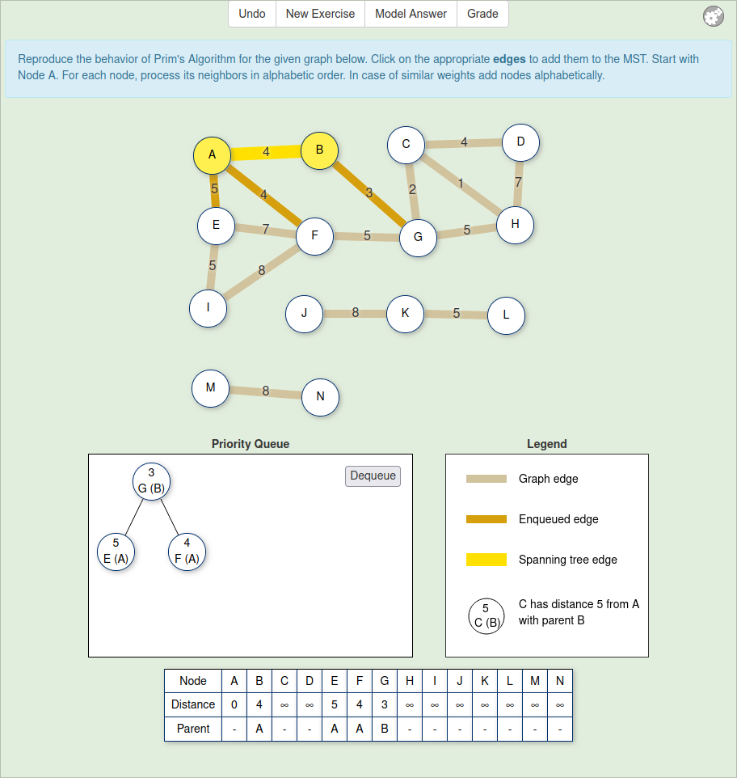

# Examples of JAAL recordings

These are real examples of complete JAAL recordings. They are produced with
[JSAV Exercise Recorder 2.0.1]() from algorithm visualization exercises
using the [JSAV framework](https://jsav.io).

## Prim's algorithm with binary heap

### Description of the exercise

This exercise is about Prim's minimal spanning tree algorithm. A screenshot
of the user interface of the exercise is shown in file
`Prim+Binheap-GUI.png`.



The exercise visualizes the input of the algorithm as a node-link diagram.
The nodes circles are labeled with unique alphabets from A to W. The edges
are lines having non-unique integer weights from 1 to 19.

In addition, there is a priority queue which the algorithm uses to track
the fringe: the nodes that should be added to the shortest paths spanning
tree, and the edges leading to those nodes.

When the student clicks an edge, they can *enqueue* it to the priority
queue. An edge can also be *updated* to replace a route from a fringe
node with a shorter one. When the student clicks the Dequeue button in the
priority queue, the edge is *dequeued* from the priority queue and added
to the spanning tree.

### File: Prim+Binheap1

#### Description

`Prim+Binheap1.json` is the JAAL data for a submission to the exercise:
                     pretty-printed JSON in ASCII character set.

`html/Prim+Binheap1.html` is the corresponding human-readable representation
of the file produced with the script `jaal2html.py`

`Prim+Binheap1.encoded.json` is an *encoded* version of the data in the file
Prim+Binheap1.json: the JSON string is HTML escaped, then zlib compressed and
finally Base64 encoded. JSAV Exercise Recorder uses this kind of wrapping
encoding to (i) minimize the size of JAAL data sent to a learning management
system (LMS); (ii) ensure that the data will not be escaped in other ways by
the LMS. The data can be decoded with the script `decoding_test.py`.

Here is a short description of the data in Prim+Binheap1.html. The strings
beginning with a `$` are JSON paths which refer to the corresponding
location in the JSON data, where `$` is the root JSON object.

`$.metadata`:
    information about the exercise and recording context.
`$.metadata.max_points`:
    the automated grade is scaled to maximum 300 points in the learning
    management system providing the exercise.
             
`$.definitions.score`:
    6 first steps of total 22 are correct.

`$.initialState`:
    There is a graph with three connected components. The largest
    connected component has ten nodes including the start node A.
    The empty node belongs to a binary tree which represents the binary
    heap (a priority queue).

`$.animation`:
    This is the student's solution. There are the following steps.
    1. Enqueue edge AB. The priority queue has now one node with the
       text "6 B (A)" indicating that node B is in the fringe with distance 6
       and parent node A.
    2. Enqueue AF.
    3. Dequeue AF. Now edge AF and its nodes are in the spanning tree.
    4. Update: replace edge BF with edge AB. Correspondingly, in the
       priority queue, node B's parent changes from A to F and its distance
       changes from 6 to 3.
    5. Enqueue edge EF.
    6. Enqueue edge FG.
    7. Dequeue edge FG.
    ...
    24. Dequeue edge IN. Here we can see the final spanning tree highlighted
        with yellow; its edges are AF, BF, BC, CD, EF, FG, EJ, IN, and JN.

`$.definitions.modelAnswer`:
    This is the model answer. Note that the model answer may have substeps.
    This is because not all steps in the model answer are gradable. For
    example, step 1.2 (`$.definitions.modelAnswer[1][0]`) is not gradable,
    but only shows some narrative text, as seen in the value of the
    `explanation` field (`$.definitions.modelAnswer[1][0].explanation`).
        Then, in step 2.1, a new route from A to B is compared to the current
    distance of B (infinity). In the visualization of the model answer, edge AB
    and node B are highlighted in green color to indicate the comparison.
    Moreover, the edge AB is enqueued, and this *is* a gradable step.
        Essentially, the model answer begins with the similar priority queue
    operations as the student's answer:
    1. Enqueue AB.
    2. Enqueue AF.
    3. Dequeue AF.
    4. Update: replace BF with AB.
    5. Enqueue EF.
    6. Enqueue FG.
    Then the model answer starts to diverge from the student's answer:
    7. Enqueue FJ.
    8. Dequeue FG.
    ...
    In the end ($.definitions.modelAnswer[22][0].image), the final spanning
    tree is similar to the student's solution: edges
    AF, BF, BC, CD, EF, FG, EJ, IN, and JN.

#### Analysis demonstration

Below is a demonstration on how much can be analyzed manually from the data 
available. This is why JAAL was first designed: to be able to see what was the
first error that the student made, and furthermore, what might be the
explanation behind all possible errors in the student's solution.

First, note that we can compare student's solution to model solution. Here it is
done manually by listing the actions. The student enqueues (enq), updated (upd)
or dequeues (deq) edges in the priority queue or clicks the undo button (undo).

```
Student          Model
--------------------------------------------------------
 1 enq AB         2.1 enq AB
 2 enq AF         3.1 enq AF
 3 deq AF         4.1 deq AF
 4 upd AB->BF     5.1 upd BF
 5 enq EF         6.1 enq EF
 6 enq FG         7.1 enq FG
 7 deq FG         8.1 enq FJ
 8 enq CG         9.1 deq FG
 9 enq FJ        10.1 enq CG
10 deq BF        11.1 deq BF
11 upd CG->BC    12.1 upd BC
12 deq BC        13.1 deq EF
13 enq CD        14.1 enq EI
14 deq CD        15.1 upd EJ
15 deq EF        16.1 deq BC
16 upd FJ->EJ    17.1 enq CD
17 enq EI        18.1 deq CD
18 deq EJ        19.1 deq EJ
19 enq JN        20.1 enq JN
20 deq JN        21.1 deq JN
21 enq IN        22.1 upd IN
22 undo          23.1 deq IN
23 upd EI->IN
24 deq IN
```

(Yes, there is not enough semantic data in the model answer in this recording,
therefore the priority queues actions in the model solution have been
reconstructed from the narration and the visual data.)

So, in the most compact sense, both student's solution and the model solution
can be represented as a string of actions: "enq AB, enq AF, deq AF, ...".

By examining images in the the student's solution manually, we obtain the
following interpretation.

Step 7: Student forgets to enqueue FJ.
Step 9: Student realizes they made a mistake and now enqueue FJ.
Steps 16-17: Students enqueues EJ and EI, while the model answer enqueues
             EI and EJ (alphabetical order)
Step 21: Student enqueues IN, when the model answer updates EI to IN.
Step 22: Student realizes the made a mistake and clicks Undo.

In this case, the mistakes were small enough to produce a totally correct
spanning tree at the end. It could be said that the student mostly follows
Prim's algoritm after the first mistake.

# More extensive description of a JAAL recording

## $: the top level
The top level structure of each JAAL recording is the following. There is
an object with four keys:

```json
{
    "metadata": {...},
    "definitions": {...},
    "initialState": {...},
    "animation": [...]
}
```

## $.metadata: Metadata

The `metadata` object contains information on the recording context.
It has the following fields:

`max_points`:
    The maximum score of the exercise as configured in the learning
    management system.

`uid`:
    Deprecated, set to zero.

`ordinal_number`:
    Deprecated, set to zero.

`browser`:
    Student's web browser. This is the [User-Agent field of a HTTP
    request](https://developer.mozilla.org/en-US/docs/Web/HTTP/Headers/User-Agent).
    
`recordingStarted`:
    A string timestamp of when the recording started; [ISO 8601 date and
    time in UTC](https://en.wikipedia.org/wiki/ISO_8601).

`recordingTimezone`:
    Time zone of the recording related to the `recordingStarted` field.

`jaalVersion`:
    JSON Algorithm Animation language version. This should be "2.0.0".

`jaalGenerator`:
    The software which recorded the JAAL data. This should be
    "JSAV Exercise Recorded 2.0.0".

`exercise`:
    This object has three fields:        
    `name`:
        The name of the exercise. In practice, this is the name of the
        HTML file of a corresponding JSAV/OpenDSA exercise.
    `collection`:
        The name of the exercise collection. This is set to
        "CS-A1141/CS-A1143" which refer to Aalto University course codes.
    `running location`:
        The absolute URL of the exercise.

## $.definitions: grading and model answer

The `definitions` object contains three subobjects.

`style`:
    Unused.

`score`:
    Information about the automated grade. It has the following subfields:
    `modelSteps`: number of gradable steps in the model solution.
    `studentSteps`: number of student's steps, including undo actions, but 
                    excluding the grade button click.
    `correctSteps`: number of correct steps. This is the automated 
                    grade.                   
    `undoSteps`: number of undo steps.

`options`:
    `title`: Title of the exercise; unused.
    `instructions`: Exercise instruction text. This may contain CSS escaped
    Unicode characters and HTML entities.

## $.initialState: the exercise instance

The `initialState` object represents the exercise instance. It contains two 
subobjects: `dataStructures` and `svg`.

`dataStructures`:
    A list of JAAL 2.0 semantic data structures. The recordings have two
    main types of data structures: graphs and matrices.

### JAAL 2.0 Graph

JAAL 2.0 graph has the following structure:

```json
{
    "id": "graph1",
    "dsClass": "graph",
    "node": [
        {
            "style": "unvisited",
            "key": "J",
            "id": "node1"
        },
        ...
    ],
    "edge": [
        {
            "id": "edge1",
            "node": [
                "node1",
                "node5"
            ],
            "style": "",
            "tag": "6"
        },
        ...
    ],
    "directed": false
}
```

The first `id` field is the JAAL id for the graph data structure.
Fields `dsClass` and `directed` indicate that this is an undirected graph.

Field `node` contains a list of nodes for the graph. Each JAAL node has at
least the following fields.

    `style`: (str)
        A style description. The start node for Prim's and Dijkstra's
        algorithm has style "visited" while all the other nodes have style
        "unvisited".
    `key`: (str)
        The node (vertex) label. This is unique. The start node has
        label "A", while other node have other letters of the alphabet.
    `id`: (str)
        JAAL id for the node.
initial
Field `edge` contains a list of edges for the graph. Each JAAL edge has at
least the following fields.

    `id`: (str)
        JAAL id for the edge.
    `node`: (list)
        A pair of JAAL node ids.
    `style`: (str)
        Unused.
    `tag`: (str)
        The integer weight of the edge.

### JAAL 2.0 Binary Tree

The Scaffolded Prim & Dijkstra exercises have the priority queue interface.
The priority queue is visualized as a minimum binary heap. In JAAL 2.0
semantic data, it is represented as another graph as follows.

```json
{
    "id": "graph2",
    "roow": "node25",
    "dsClass": "tree",
    "dsSubClass": "binarytree",
    "directed": true,
    "node": [...],
    "edge": [...]
}
```

### JAAL 2.0 SVG

The `svg` object of the `initialState` object is Scalable Vector Graphics
representation of the initial state. Note that the SVG has been further
escaped, including the following codes:

Escaped     Unescaped
---------------------------------
\"          "
\\n         newline

# $.animation: Student's solution

The `animation` object is a list of steps in student's solution. Each step
is an object with the following fields.

`type`: (str)
    The step type.
    `click`: The student clicks an element in the visualization.
    `undo`: The student clicks the Undo button.
    `grade`: The student clicks the Grade button.

`time`: (int)
    Timestamp in milliseconds from `metadata.recordingStarted`.
    This is intentionally rounded to closest hundred milliseconds for
    anonymization purposes.

`currentStep`: (int)
    The ordinal number of the step in student's solution sequence.

`gradable`: (boolean)
    `true` if the step is regarded as a gradable step in the automated
    grading, `false` otherwise. Typically `click` steps are gradable but
    `undo` steps are not.

`object`: (str)
    If the `type` of the step is `click`, this is the JAAL id of the
    corresponding edge in `initialState.dataStructures`.

`image`: (str)
    A JAAL 2.0 SVG image similar to the one in `svg.initialState`, but
    representing the data structures in the student's view after the action
    (click/undo/grade).

`pqOperation`: (str)
    The type of a priority queue operation; one of `enqueue`, `dequeue`,
    `update`. This field is only in the scaffolded versions of the exercises
    having a priority queue interface.

`pqIn`: (str)
    If there is a `pqOperation` field with value `enqueue` or `update`,
    this specifies the JAAL id of the edge to be enqueued or updated in the
    priority queue, correspondingly.

`pqOut`: (str)
    If there is a `pqOperation` field with value `dequeue` or `update`,
    this specifies the JAAL id of the edge to be dequeued or replaced in the
    priority queue, correspondingly.
